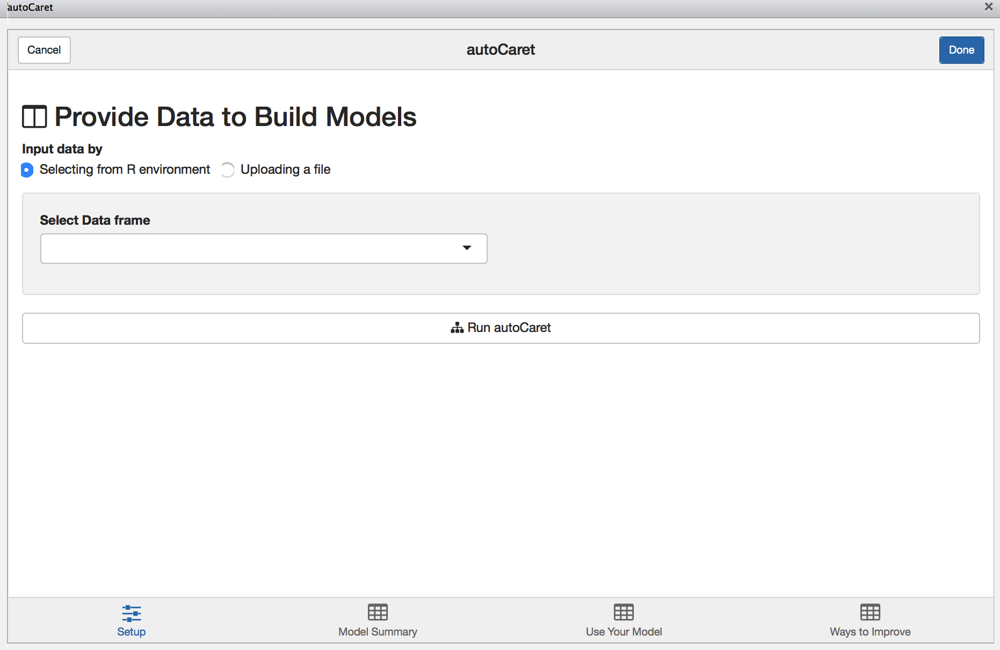
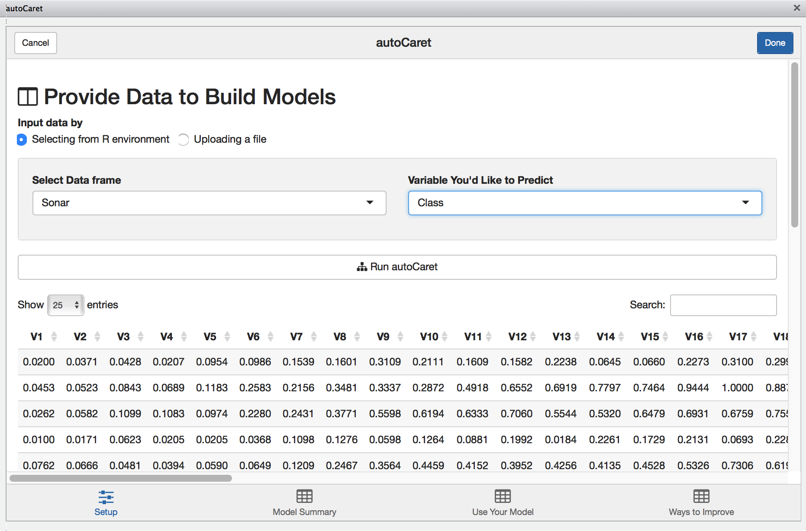
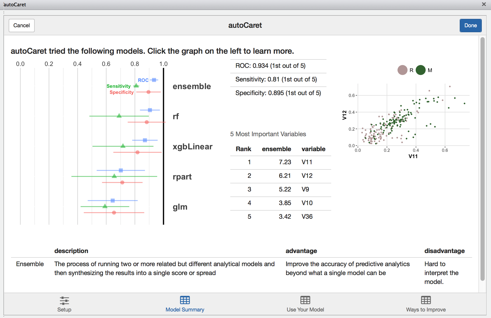
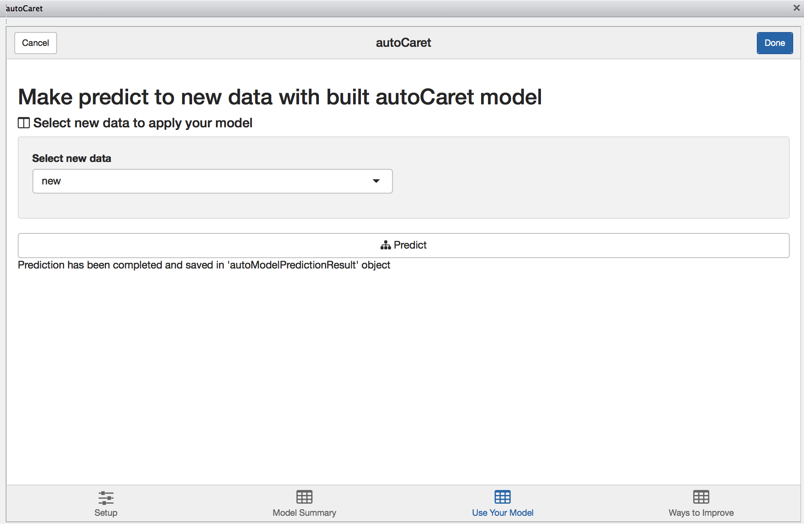
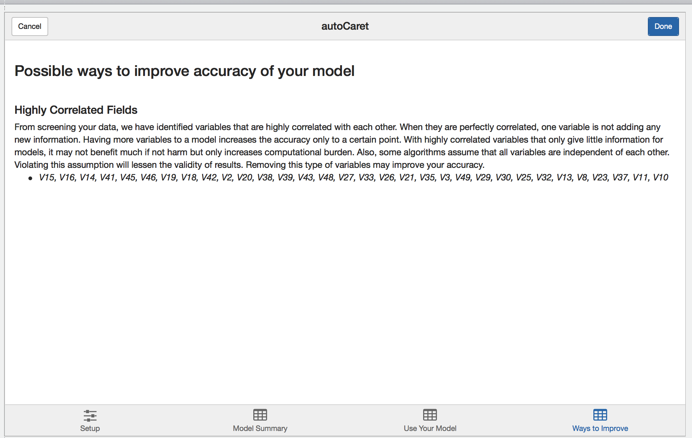

## Using the `autoCaret` add-in

As an alternative option to the CLI, we provide an intuitive GUI in the form an [RStudio Addin](https://rstudio.github.io/rstudioaddins/).

The add-in may be accessed in two ways:

- Via the Addin menu following loading `autoCaret` via `library(autoCaret)` in [a recent release of Rstudio]( https://www.rstudio.com/products/rstudio/download/)
- By running the following non-exported function autoCaret:::autoCaretUI().

### Setup Screen

When launched, you'll be presented with the following screen. 



From here you may either:

- Upload a file containing your dataset
- Select the dataset you wish to model from your local `R` environment

**Note:** There will be nothing available to list if you have yet to load a `data.frame` in your local Global environment. 

To illustrate the GUI's use, let's use the same `Sonar` dataset from the above examples:



With the Sonar data.frame selected, we'll be presented with a preview of our data to visually inspect. Once we select the appropriate variable to predict, clicking `Run autoCaret` will launch the underlying process.

When modeling completes, the other tabs in the Addin are enabled and you may select them to view their contents. 

### Model Summary

The model summary screen provides an interactive way for you to review the resultant model object created when running `autoCaret`.



Clicking on the left hand side results visualization provides a layer of interactivity. This is a useful for  comparing the results of various models tried during the training phase and for gaining a better intuitive sense of the strengths and weaknesses of your models. 

### Predicting new data

Like in the section above, we use the `new` data.frame to simulate predictions. 

```{r eval=FALSE, warning=FALSE, message=FALSE}
#For the sake of example, simulate new data by resampling our original data frame
new <- Sonar[sample(1:nrow(Sonar), 50, replace=TRUE),]
```

Having it pre-exist in our Global Environment, we can select it from dropbown on the `Use your model` tab. Once we compute predictions, they will be saved in our Environment and named _autoModelPredictionResult_. 



### Learning more

Finally, during the modelling process, `autoCaret` runs a variety of diagnostics that help validate the underlying distribution and features of your data prior to pre-processing. Depending on what we find, we surface these as qualitative suggestions on the `learning more tab`. Feel free to review and incorporate these suggestions in the data cleaning step as you build <a href="https://en.wikipedia.org/wiki/Binary_classification" target="_top">binary classifiers</a> with `autoCaret`. 


